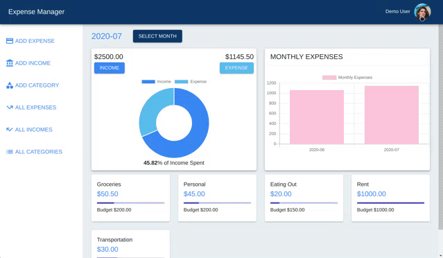
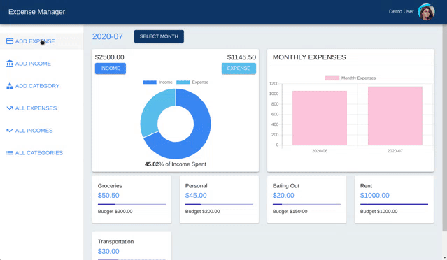
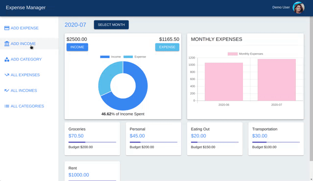
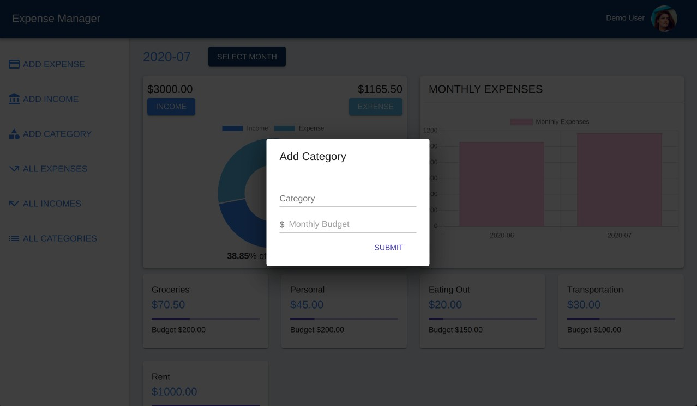
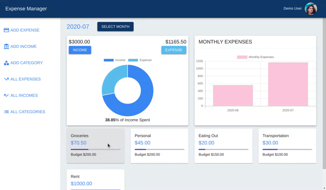
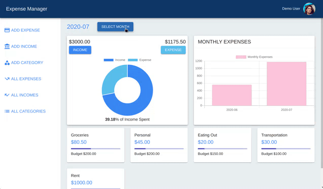
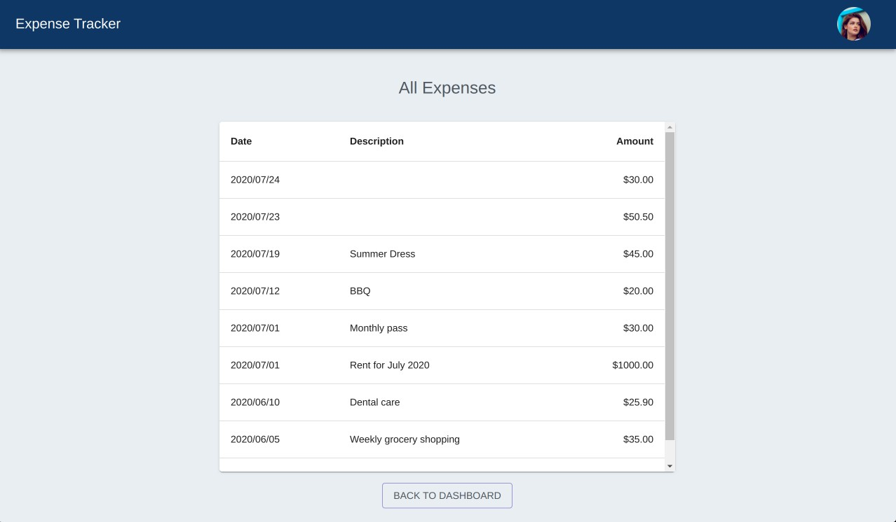
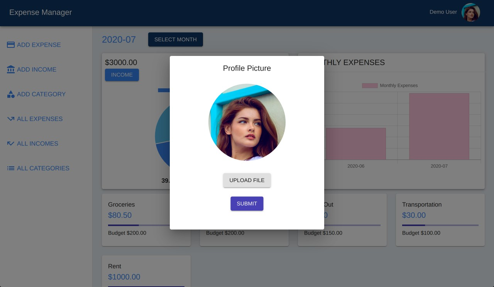

# Expense Manager

This is an application to track your income and expenses. Users can save income and expense data and the app displays data with graphs. Data can be filtered by month. <br></br>
Responsive for both web and mobile.<br></br>
### [**Live Demo**](https://yasuko-expense-manager.herokuapp.com/)


## Build with

* Backend
    * Node
    * Express
    * Postgres 
    * AWS S3 bucket

* Frontend
    * React
    * Redux
    * Material-UI


## Requirements

* Make sure you have install and run PostgreSQL server.
* Create database with the name same as in config file.


## Getting Started 

* To get started, clone the repo to your local machine.

    ```https://github.com/ykurata/expense-tracker.git```

* Install all dependencies on the both back end and front end. 

    **Backend (Server)**
        
    * Go to the server directory, and run `npm install`.
    
    * Run `sequelize db:migrate`

    * To start server, run `npm start`.


    **Frontend (Client)**

    * Go to the client directory, and run `npm install`.

    * To start client, run `npm start`.

## Features
* ### Register/ Login / Logout
<div align="center">
  
</div>    
<br />
<br />

* ### Add expense
<div align="center">
  
</div>    
<br />
<br />

* ### Add income
<div align="center">
  
</div>    
<br />
<br />

* ### Add expense category
<div align="center">
  
</div>    
<br />
<br />

* ### Edit and delete data
<div align="center">
  
</div>    
<br />
<br />

* ### Filter data by month 
<div align="center">
  
</div>    
<br />
<br />

* ### All expenses and income
<div align="center">
  
</div>  
<br />
<br />

* ### Add profile image
<div align="center">
  
</div>  
<br />
<br />
